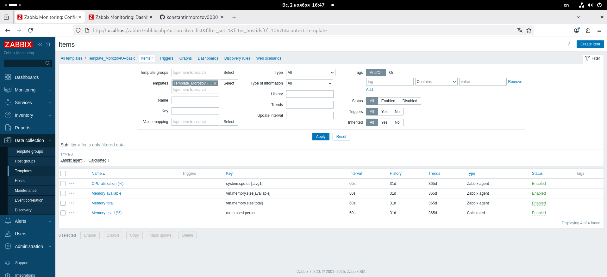

# Домашнее задание: Система мониторинга Zabbix. Часть 2

**Автор:** Константин Морозов  
**Курс:** SYS-49  
**Тема:** Система мониторинга Zabbix. Часть 2

---

## Цель работы

- Создать собственный шаблон в Zabbix с элементами для мониторинга CPU и RAM  
- Добавить хосты и связать с шаблонами  
- Настроить кастомный дашборд  
- Научиться работать с UserParameter и скриптами  
- Освоить автоматизацию с помощью Vagrant

---

## Задание 1. Создание шаблона для мониторинга CPU и RAM

### Выполненные действия:
- Создан новый шаблон **Custom CPU+RAM Monitoring**  
- Добавлены элементы данных:
  - **CPU Load (%)**
  - **RAM Usage (%)**
- Настроен интервал опроса — 60 секунд
- Проверена корректность получения данных через **Latest data**

### Скриншот:

---

## Задание 2. Добавление хостов в систему

### Выполненные действия:
- Добавлены два хоста:
  - `morozovk-1`
  - `morozovk-2`
- Установлен **Zabbix Agent** на оба хоста
- В конфигурацию добавлен IP-адрес Zabbix Server (`Server=...`)
- Хосты добавлены в группу **Linux servers**
- Привязан шаблон **Linux by Zabbix Agent**

---

## Задание 3. Привязка пользовательского шаблона

### Выполненные действия:
- К каждому хосту привязан созданный шаблон **Custom CPU+RAM Monitoring**
- Проверена передача данных в **Monitoring → Latest data**
- Оба хоста имеют зелёный статус подключения

### Скриншот:

---

## Задание 4. Создание кастомного дашборда

### Выполненные действия:
- Создан новый дашборд **CPU & RAM Dashboard**
- Добавлены виджеты:
  - Графики загрузки CPU для `morozovk-1` и `morozovk-2`
  - Графики RAM Usage
  - Общий виджет со статусом хостов
- Настроено автообновление каждые 30 секунд

### Скриншот:

---
