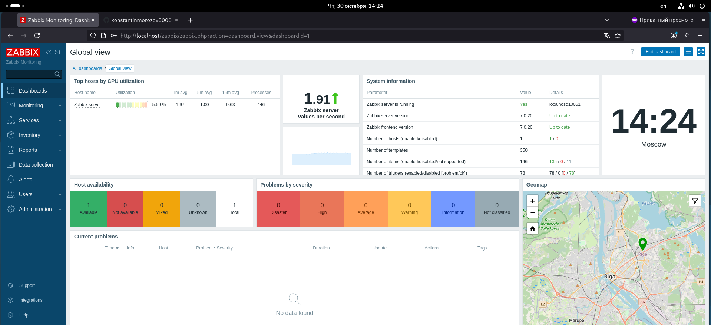

# Домашнее задание: Система мониторинга Zabbix
**Автор:** Константин Морозов

---

## Задание 1. Установка Zabbix Server с веб-интерфейсом

### Использованные команды:
```bash
sudo apt update
sudo apt install postgresql
sudo -u postgres createuser zabbix
sudo -u postgres createdb -O zabbix zabbix
sudo apt install zabbix-server-pgsql zabbix-frontend-php zabbix-apache-conf zabbix-sql-scripts zabbix-agent

### Скриншот авторизации в Zabbix



